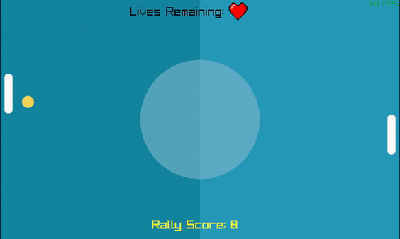

# Unbeatable Pong

Unbeatable Pong is a simple Pong game built using the Raylib library in C++. The game features a classic Pong gameplay experience with some additional features and customization options.

## Features

- Classic Pong gameplay with player-controlled paddle and CPU-controlled opponent.
- Keep track of lives remaining as you play.
- Sound effects for paddle hits and lost hearts.
- Start screen with a "Start" button to begin the game and a "Settings" button to access game settings.
- End screen with an option to restart the game or exit.
- Rally score to keep track of consecutive hits.
- Realistic ball physics and paddle collisions.

## How to Play

1. **Start Screen**: Upon launching the game, you'll see the start screen with "Start" and "Settings" buttons. Click "Start" to begin playing or "Settings" to access game settings.

2. **Gameplay**: Control the paddle using the W and S keys (move up and down, respectively). Try to hit the ball past the CPU-controlled opponent to score points.

3. **Lives Remaining**: Keep an eye on the lives remaining indicator at the top of the screen. You start with three lives, and each time the opponent scores, you lose a life.

4. **Rally Score**: The game keeps track of your consecutive hits (rally score). Try to achieve the highest rally score possible!

5. **End Screen**: When you run out of lives, the game ends, and you'll see the end screen with options to restart or exit the game.

## Controls

- W: Move paddle up.
- S: Move paddle down.

## How to Customize

1. **Speed**: You can adjust the speed of the ball in the settings. Set the speed rate in the settings screen to your preferred value.
2. **Paddle and Ball**: The paddle and ball respond with standard collision detection and a responsive CPU-controlled opponent that adjusts based on the ball's position.

## Game Setup

### Requirements
- C++ (preferably with C++11 or later)
- Raylib Library (Version >= 3.7)
- Sounds and textures (see resources directory)

1. Download Raylib from [Raylib GitHub](https://github.com/raysan5/raylib).
2. Add your compiled Raylib directory to the project.
3. Ensure that the `resources` folder contains the required sound files (`Lost_Heart.wav`, `Lost_Game.wav`, `Paddle_Hit.wav`, `Paddle_Hard_Hit.wav`) and texture files (`Heart.png`).
4. Compile and run `main.cpp` to launch the game.

## Controls for Playing

- **W**: Move the player paddle up.
- **S**: Move the player paddle down.

### Game Features
- **Rally Score**: Track the consecutive hits during a rally, attempt to reach a high rally score before losing a life.
- **Lives**: You start the game with three lives. Each time the CPU scores, you lose a life.
- **End Screen**: At the end of the game, a screen appears with options to restart or exit.
- **Settings**: Modify game speed through the settings menu.

## Credits

This game was created by Tanveen Singh Bal.

## Image/GIF

